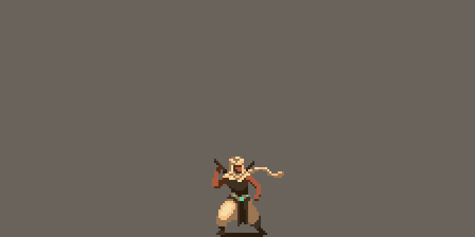
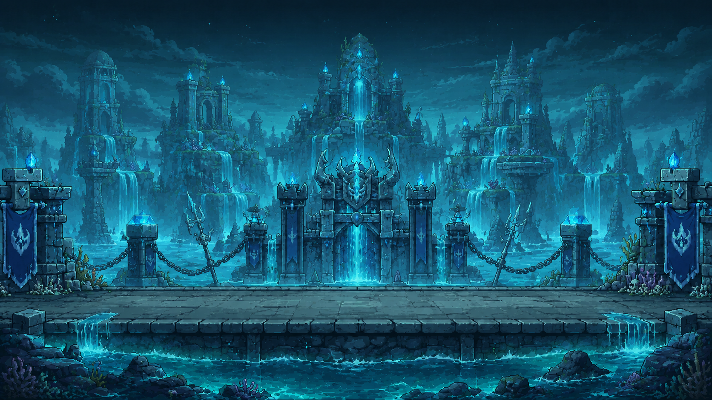
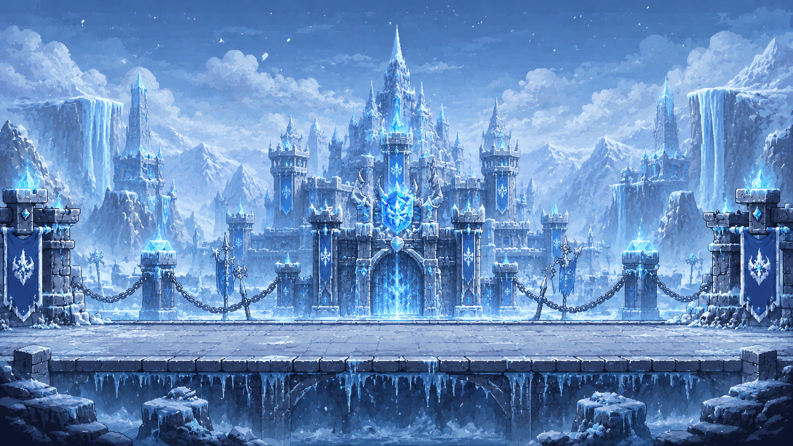
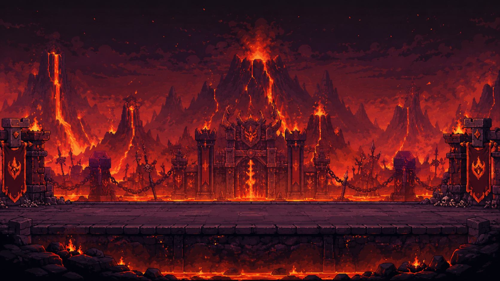
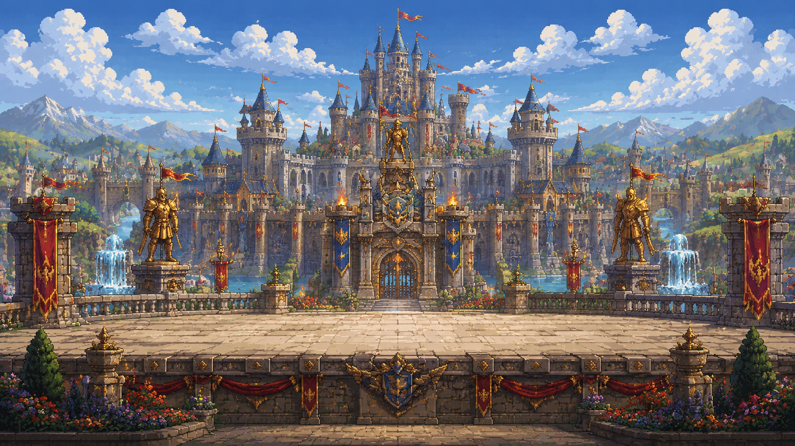

  
    
  <h1>⚔️ RUNEBORN ⚔️</h1>
  
<strong>A Next-Gen Cyber-Arcane 2D Fighting Experience</strong>

  

    
    
    
    
    
    
  

  

  
  
  
  
  

🔮 The Project
Runeborn is a high-fidelity, pixel-art arcade fighting game built on a custom HTML5 Canvas physics engine, wrapped in a breathtaking React-based "Cyber-Arcane" interface.
What makes Runeborn truly unique is its Hardware Integration. Players can ditch the traditional keyboard and use an ESP32 Microcontroller with an MPU6050 Gyroscope to physically swing, block, and cast spells through real-life motion gestures!

  

✨ Features
🖥️ Cyber-Arcane UI: A highly polished, glassmorphic React frontend driven by immersive GSAP animations and dynamic background routing.
🗡️ Intense 2D Combat: Fast-paced arena battles with combos, rolling, traps, and projectiles.
📡 ESP32 Motion Controls: Connect a custom hardware controller via the Web Serial API to translate physical wrist flicks and thrusts into devastating in-game combos.
🤖 AI Opponents: Battle against adaptive Dummy bots with multiple difficulty levels (Easy, Medium, Hard).
🌐 LAN & Online Play: [Coming Soon] Fight friends across the local network or the world.

  

🤺 The Champions (Elementals)

  

Choose your fighter from an elite roster of elemental warriors. Each character is painstakingly animated frame-by-frame and rendered natively onto the canvas.
Table
Preview	Element	Champion	Playstyle	Signature Color
	🔥	Fire Knight	Aggressive, High Damage	Crimson Red (#DC143C)
	💧	Water Priestess	Fluid strikes, Area Control	Cyan (#00fbfb)
	🍃	Earth Mauler	Defensive, Heavy Hits	Emerald Green (#00ff00)
	💨	Wind Assassin	Fast movement, Evasion	Silver (#ffffff)
	⚙️	Metal Guardian	Unstoppable armored force	Slate Gray (#aaaaaa)
	💎	Crystal Mage	Ranged zoning, Trap placement	Neon Magenta (#ff00ff)
🗺️ The Arenas

  

Step into beautiful, dynamic battlegrounds featuring cinematic backgrounds and distinct atmospheric lighting.
<table align="center" style="border-collapse: collapse; border: none;">
  <tr>
    <td align="center" style="border: none; padding: 10px;">
       
      <b>🌊 Water Arena</b>
    </td>
    <td align="center" style="border: none; padding: 10px;">
       
      <b>❄️ Frozen Ruins</b>
    </td>
  </tr>
  <tr>
    <td align="center" style="border: none; padding: 10px;">
       
      <b>🌋 Volcanic Fortress</b>
    </td>
    <td align="center" style="border: none; padding: 10px;">
       
      <b>👑 Royal Arena</b>
    </td>
  </tr>
</table>
🚀 Getting Started

  

Prerequisites
Node.js (v16+ recommended)
An ESP32 with an MPU6050 module (Optional, for Gyro Motion Controls)
Installation
Clone the repository:
bash
git clone https://github.com/yourusername/runeborn.git
cd runeborn
Install dependencies:
bash
npm install
Start the Arcane Engine:
bash
npm run dev
Open http://localhost:5173 in your browser.
🎮 Controls

  

Keyboard (Standard)
Move: A / D (or Left/Right Arrows)
Jump: W (or Up Arrow / Space)
Roll: S (or Down Arrow)
Light Attack: F
Heavy Attack: G
Combo Attack: H
Projectile: CTRL
Defend: C
Trap: T
Ultimate / Special: X
ESP32 Motion Controller
Attack: Clockwise Wrist Flick
Defend: Trigger Button
Ultimate: Hard Downward Thrust
(Note: Requires Web Serial API support in your Chromium-based browser).

  
    
  
  
  
  
  
    
  <i>"May your runes burn bright and your strikes strike true."</i>
    
  

